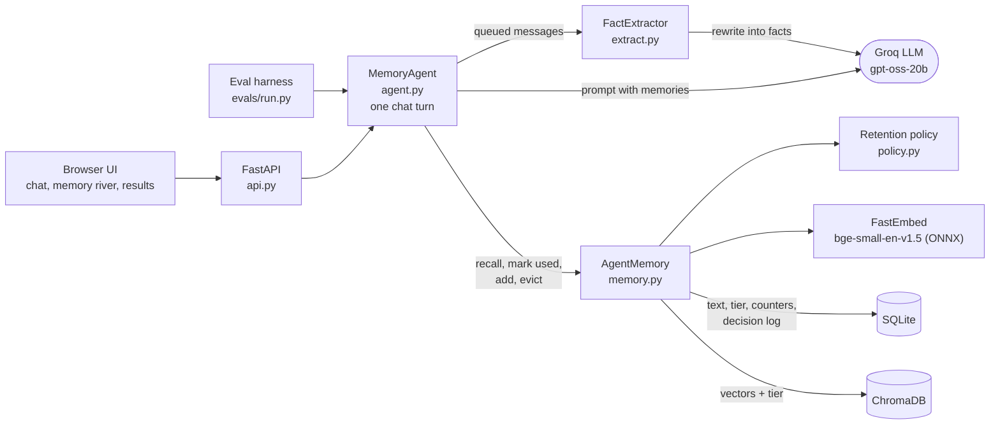
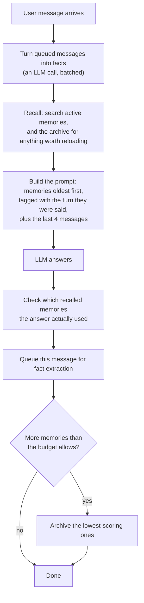
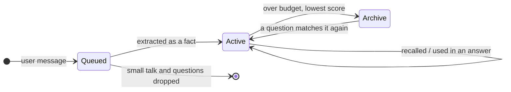

# lethe


**Long-term memory for LLM agents.** lethe decides what an agent should remember from a conversation, what to set aside, and when to bring something back, and it measures whether that actually helps.

**Live demo:** https://lethe-agent-memory.onrender.com (free hosting, so the first visit can take a minute to wake up). Click **Watch a 30-second demo** to see memory being kept, archived and brought back without typing anything.

---

## The idea in 30 seconds

Chat assistants forget things said early in a long conversation, or they resend the entire conversation with every message, which gets slow and expensive and eventually stops fitting in the model at all.

lethe sits between the user and the model and works like a small, well-kept notebook:

1. **Keep what matters.** An LLM turns messages into short facts ("I now live in Bangalore (moved from Noida)") and drops small talk ("lol ok", "traffic was crazy").
2. **Set aside what isn't being used.** Only a small set of facts is kept active. When that set is full, the least useful fact is moved to an archive.
3. **Bring it back when it matters again.** If a new question matches an archived fact, it comes back into the prompt automatically.

The name comes from Lethe, the river of forgetting in Greek myth. The UI shows memory as a river: kept facts float at the surface, archived ones sink below the waterline, and they rise again when needed.

---

## Results

Tested on **20 conversations kept aside and never used for tuning**. Each one mentions facts early, buries them under small talk, then asks about them later: 39 questions per setup, every setup run **3 times**, every answer graded by a separate, larger model against a reference answer.

| Setup | What it does | Accuracy | Likely range (95%) | Text sent to the model per answer | Memories held |
|---|---|---|---|---|---|
| No memory | Sees only the last 4 messages | 2% | 0–4% | 141 tokens | none |
| Full history | Resends the whole conversation every time | 92% | 79–100% | 515 tokens | whole chat |
| Search everything | Saves every message, searches them (standard RAG) | 97% | 92–100% | 255 tokens | 25.0 |
| **lethe** | Keeps a small set of extracted facts, archives and reloads | **97%** | **93–100%** | **245 tokens** | **3.0** |

**What this shows**
- lethe is **as accurate as the best setup tested** while holding **3 memories instead of 25** (88% fewer) and sending **about half the text per answer** of full history.
- **Full history gets confused by lookalike facts** (70% on questions like "work laptop password vs personal laptop password"). It also scored 50% on these in an early practice-set run, and 67% in one of two runs on the earlier unseen chats (the other run scored 100%).
- The judge and a keyword check agreed on 99% of answers.

**What this doesn't show** (see [Limitations](#limitations))
- That lethe beats full history: 97% vs 92% looks like a win, but the likely ranges overlap, so it isn't proven.
- That lethe is cheaper overall *in this test*: turning messages into facts costs about 3,150 tokens per conversation. Here only the questions get answers, so in these short chats lethe uses more tokens in total. We expect the savings to appear in real chats where every message gets a reply and full history keeps resending a growing conversation. This hasn't been tested yet; it's the next experiment.

| By kind of question | No memory | Full history | Search everything | lethe |
|---|---|---|---|---|
| Several facts at once | 2% | 100% | 100% | 100% |
| Lookalike facts | 0% | 70% | 100% | 93% |
| Facts that changed over time | 4% | 100% | 88% | 96% |
| Long gaps (20+ messages) | 0% | 100% | 100% | 100% |

Model: `openai/gpt-oss-20b` on Groq for answers and fact extraction, `openai/gpt-oss-120b` as the judge. Memory budget: 6. Raw results: `evals/results/`.

---

## How it works

### Architecture



The API and the eval harness call the **same** `MemoryAgent`, so the benchmark measures exactly the pipeline the demo runs.

| Part | File | Job |
|---|---|---|
| Chat turn | `lethe/agent.py` | Runs one turn end to end (below). |
| Memory | `lethe/memory.py` | Recall, archive, reload, usage tracking. Every move between active and archive updates SQLite and Chroma together. |
| Fact extraction | `lethe/extract.py` | Turns batches of messages into short standalone facts. |
| Retention policy | `lethe/policy.py` | Scores how worth keeping each memory is; checks whether an answer used a memory. |
| Storage | `lethe/store.py` | SQLite: memory text, active/archive tier, counters, recent messages, and a log of every decision. |
| Vector search | `lethe/index.py` | ChromaDB with FastEmbed embeddings, filtered by conversation and tier. |
| LLM client | `lethe/llm.py` | Groq API with rate-limit pacing, retries, and a fail-fast stop when the daily quota runs out. |
| Settings | `lethe/models.py` | Every threshold and weight, in one place. |
| Web app | `lethe/api.py`, `lethe/static/` | API endpoints and the single-file UI. |

### One chat turn



**1. Fact extraction.** Messages are queued and turned into facts in batches (every 8 messages, or right before an answer is needed), so it costs about one extra LLM call per several messages. The extractor:
- drops small talk, one-off activities ("I made coffee") and same-day plans ("watching a show tonight");
- writes standalone first-person facts and keeps names, numbers and codes exactly;
- writes changes as changes, restating what changed in the words someone would ask about it: "I now live in Bangalore (moved from Noida)";
- is shown related facts already in memory, so an update that arrives in a later batch is still recognised as an update;
- keeps the turn each fact came from;
- falls back to storing the raw messages if its output can't be parsed, so nothing is silently lost.

**2. Recall and reload.** The question is embedded and matched against active memories (cosine similarity ≥ 0.6). The archive is searched too; an archived memory scoring ≥ 0.65 moves back to active. The reload threshold was tuned on the practice set only.

**3. Ordered memories.** Recalled memories are shown to the model **oldest first, each tagged with the turn it was said**, with a note that the latest one is the current truth. Ranked by similarity instead, the model answered questions about changed facts backwards ("before Farah, my lead was Omkar"). This one change fixed most of those errors.

**4. Did the answer use it?** After each answer, lethe checks which recalled memories actually show up in it (word overlap, ignoring words that came from the question itself, since an answer echoing the question isn't evidence a memory was used).

**5. Archiving.** When active memories exceed the budget, the lowest scorers move to the archive. Anything touched in the last few turns is protected.

### The retention score

```
score = 0.4 × recency + 0.2 × use frequency + 0.4 × used rate

recency        halves every 20 turns since the memory was last used
use frequency  1 − 1/(1 + times used)
used rate      (times used + 1) / (times recalled + 2)
```

Memories that keep getting recalled but never used sink fastest. Being recalled alone never raises a score; only being used does. (Both rules came from bugs found in live testing; see below.) Every decision is logged with its score breakdown, so any archive decision can be explained.

### Memory lifecycle



Nothing is ever deleted: archived memories stay searchable and come back when a question needs them.

---

## How it got here

The interesting part of this project is what the measurements changed.

| Change | Before → after | Measured on |
|---|---|---|
| Lowered the archive-reload threshold (0.75 → 0.65) | lethe accuracy (raw-message version) **62% → 100%** | practice chats |
| Showed memories in time order with turn tags | Questions about changed facts **38% → 100%** (search everything) | earlier unseen chats |
| Stored extracted facts instead of raw messages | Memories held **27.5 → 4.8** (search everything), accuracy 100% → 97% | earlier unseen chats |
| Showed the extractor what it already knew, then taught it to skip one-off activities | Junk facts stored **20 → 7 → 1** (16 chats) | practice chats |

The junk counts include "My neighbours are noisy", which is a judgment call: counted as a lasting fact instead, they would be 19 → 7 → 0.

**Bugs found by testing, each now covered by a regression test:**
- An answer repeating the question's words counted as "using" a memory. Fix: ignore words that came from the question.
- Being recalled refreshed a memory's recency, so noise kept itself alive. Fix: only being *used* refreshes it.
- The frequency term rewarded memories that were recalled but ignored, so chatter outscored real facts. Fix: count uses, not recalls.
- The keyword grader passed reversed answers ("before Farah, it was Omkar" contains "Farah"). Fix: an LLM judge, checked against a manual review of the answers where the two scorers disagreed; it flagged exactly the three reversed answers found by hand.
- The grader missed answers using a Unicode hyphen (`P2‑117`). Fix: normalise text before matching.
- The model (gpt-oss) sometimes returns its answer in a malformed tool-call format, which Groq rejects. Fix: retry, and as a last resort recover the text from the error. Counted in every run; in the final run it caused 3 retries and **0** recovered answers (21 of its 240 conversation runs finished before the counter existed and aren't included).
- A daily-quota error once retried for 35 minutes and then lost the whole run. Fix: stop immediately on daily limits, and save progress after every conversation so `--resume` continues.

**A lesson about evaluating honestly:** the practice-set score once dropped from 96% to 86% after cleaning up the extraction prompt. The old prompt's examples were near-copies of practice-set answers, which was the likely cause of the inflated score. All prompt examples were then checked to share no words or sentence patterns with any test set, and the score recovered to 96% with a general rule instead.

---

## Evaluation method

- **Three sets of conversations.** A practice set (16 chats) for tuning, and two held-out sets. The first held-out set's failures exposed the reversed answers and led to the time-ordering change and the LLM judge, so it's no longer fully independent. The second was never used for tuning and gives the final numbers. Tests check that no fact sentence or filler line is shared between any two sets.
- **Setups compared:** no memory, full history, search everything (standard RAG), and lethe, all on identical conversations.
- **Scoring:** an LLM judge compares each answer with a reference answer; a keyword check runs alongside and the agreement rate is reported.
- **Uncertainty:** every setup runs 3 times, and each score gets a 95% range by resampling whole conversations. Differences inside that range aren't treated as real.
- **Cost-aware:** only question turns call the model (small talk gets a canned reply), to stay within the Groq free tier. Runs checkpoint after every conversation and resume after quota stops.

```bash
python -m evals.run --dry-run                       # offline check, no API calls
python -m evals.run                                 # practice set
python -m evals.run --split heldout2 --conditions no_memory full_history naive_rag lethe_extract --repeats 3 --judge
python -m evals.run ... --resume                    # continue after a quota stop
python -m evals.rescore --split heldout --judge     # re-grade a saved run
```

---

## Limitations

- **Short test conversations.** 20–50 messages. Most setups score 92–100%, so the benchmark has little room to separate them, and it doesn't stress the situation lethe is built for: long chats where memory keeps growing.
- **Extraction isn't free.** About 3,150 tokens and 4.7 extra calls per test conversation.
- **Some updates are still missed.** When a change is phrased very differently from the old fact ("started a new book" vs "I'm reading X"), the new fact can fail to match the question.
- **One model family.** All results use gpt-oss on Groq.
- **Usage detection is lexical.** An answer that paraphrases a memory may not count as using it.

## What's next

- **Scale test:** conversations of 200–400 messages where every message gets a reply, measuring accuracy, total tokens and memory size as conversations grow.
- **Learned retention:** train the score weights from logged used/ignored outcomes instead of setting them by hand.

---

## Run it locally

```bash
python -m venv .venv
.venv\Scripts\Activate.ps1          # Windows PowerShell; on macOS/Linux: source .venv/bin/activate
pip install -e ".[dev]"
cp .env.example .env                # add your GROQ_API_KEY (free at console.groq.com)
uvicorn lethe.api:build_default_app --factory --reload
```

Open http://127.0.0.1:8000. Set `LETHE_BUDGET=6` in `.env` to see archiving within a short chat.

| Setting | Default | Meaning |
|---|---|---|
| `GROQ_API_KEY` | (required) | Groq API key |
| `GROQ_MODEL` | `openai/gpt-oss-20b` | Model for answers and extraction |
| `LETHE_BUDGET` | 40 | Max active memories per chat; beyond this the lowest scorers are archived |
| `LETHE_EXTRACT` | 1 | 1 = store extracted facts, 0 = raw messages |
| `LETHE_DEMO_PER_CHAT` / `LETHE_DEMO_PER_DAY` | 0 (off) | Message caps for a public demo |

**Tests:** `pytest -q` runs fully offline (fake embedder and fake LLM). CI runs the tests and `ruff` on every push.

**API:** `POST /sessions/{id}/chat`, `GET /sessions/{id}/memories`, `GET /sessions/{id}/ops` (decision log), `GET /eval/{split}`, `GET /health`.

**Demo recording:** `python scripts/make_demo.py` regenerates `lethe/static/demo.json` by running lethe's real memory code with a scripted model (no API key needed).

## Deploy

- **Render** (the live demo): `render.yaml` sets up a free web service; add `GROQ_API_KEY` when asked. The embedding model downloads at build time. Memories reset when the instance restarts.
- **Docker:** `docker build -t lethe . && docker run -p 7860:7860 -e GROQ_API_KEY=... lethe`

## Project layout

```
lethe/          memory system, API and UI
  agent.py      one chat turn (shared by API and evals)
  memory.py     recall, archive, reload, usage tracking
  extract.py    fact extraction
  policy.py     retention score, usage check
  store.py      SQLite storage and decision log
  index.py      ChromaDB + FastEmbed
  llm.py        Groq client
  models.py     all settings
  api.py        FastAPI app
  static/       UI and recorded demo
evals/          benchmark: task sets, runner, judge, results
scripts/        demo recorder
tests/          offline test suite
```
